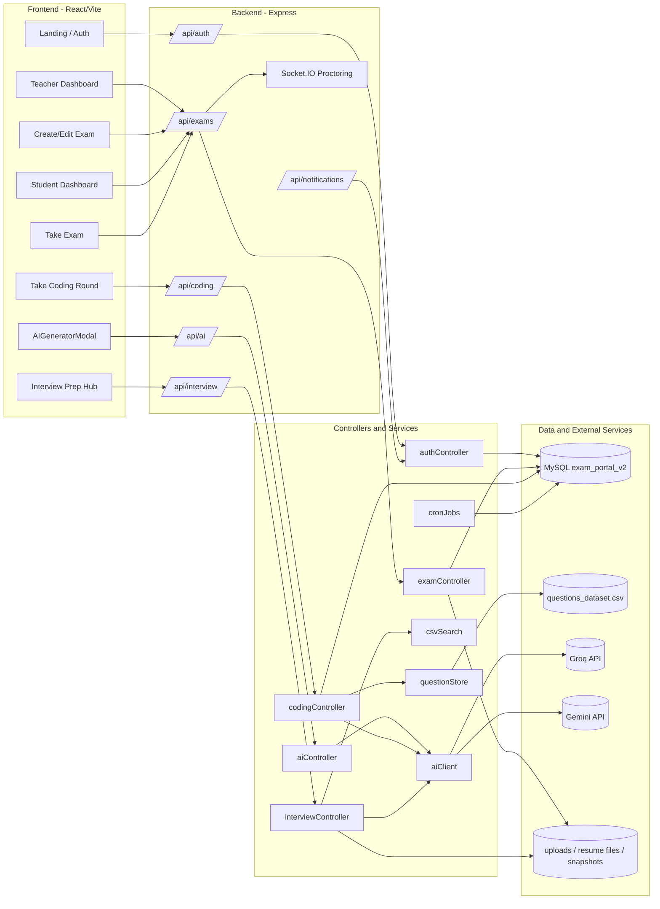
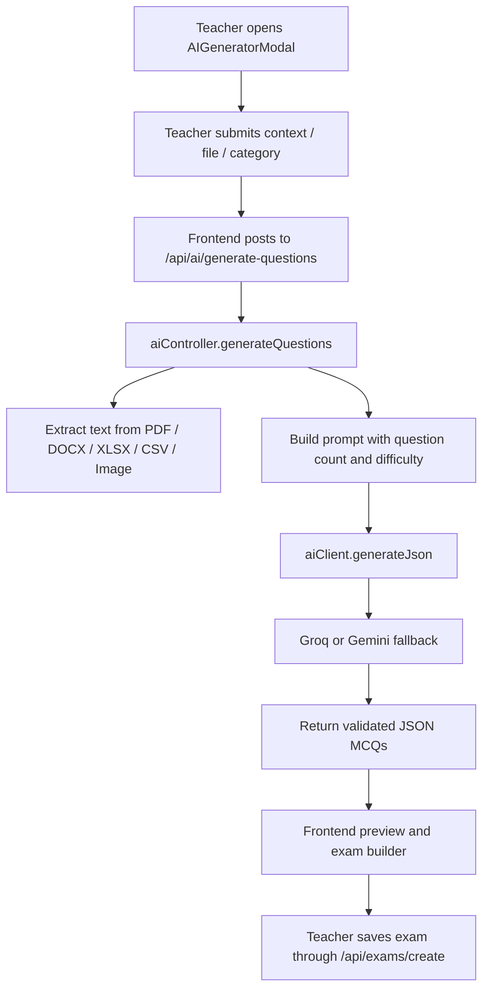
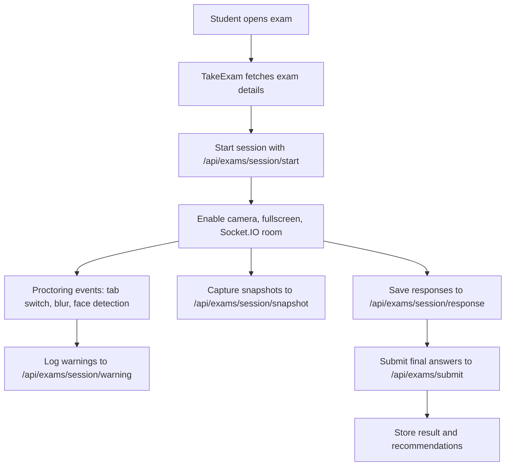
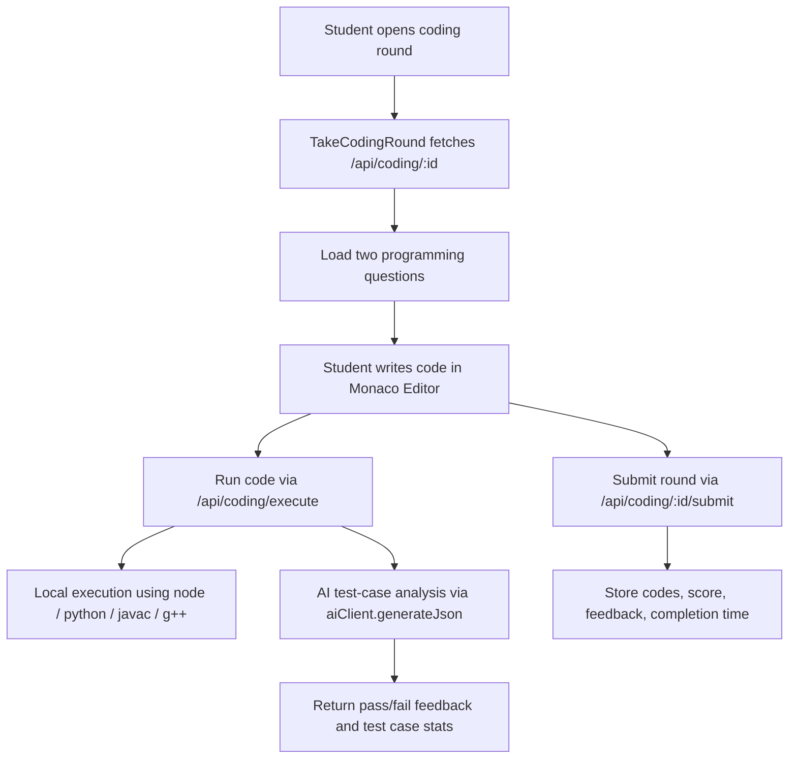

# ExamPro AI - Architecture and Implementation Report

## 1. Executive Summary

ExamPro AI is a full-stack examination platform built with React, Express, Socket.IO, and MySQL. The system supports three major workflows:

1. Teacher-driven MCQ generation from documents or pasted context.
2. Student exam delivery with live proctoring, snapshots, warnings, and final submission.
3. Coding round generation, local execution, AI-based test-case analysis, and final grading.

The backend is the control plane for authentication, AI orchestration, exam persistence, and real-time proctoring. The frontend is the user-facing execution layer for teachers, students, and admins.

## 2. Architecture Diagram

## 3. Data Flow

### 3.1 MCQ Generation Flow

### 3.2 Exam Delivery Flow

### 3.3 Coding Round Flow

## 4. Database and Data Model

The schema is defined in [backend/src/config/schema.sql](backend/src/config/schema.sql#L1). The main entities are:

| Table | Purpose |
| --- | --- |
| `teachers` | Teacher and admin identity, blocking, and token tracking |
| `students` | Student identity, PRN, resume text, and skill parsing |
| `exams` | Exam metadata, scheduling, and ownership |
| `exam_questions` | MCQ content, options, marks, difficulty, and topic |
| `exam_results` | Final exam score and result summary |
| `exam_sessions` | Live exam session state and proctoring lifecycle |
| `exam_warnings` | Warning history such as tab switch, no face, and fullscreen exit |
| `exam_session_actions` | Audit trail for teacher/system proctoring actions |
| `student_responses` | Per-question answer tracking |
| `exam_learning_recommendations` | Adaptive learning output after submission |
| `notifications` | Student and teacher notification delivery |
| `interviews` | Interview prep attempts and feedback |
| `interview_questions` | Interview MCQs and explanations |
| `coding_interviews` | Coding round questions, code submissions, and AI feedback |

The key relationships are:

1. `teachers` own `exams`.
2. `exams` own `exam_questions`, `exam_results`, `exam_sessions`, and `exam_learning_recommendations`.
3. `exam_sessions` own `exam_warnings`, `exam_session_actions`, and `student_responses`.
4. `students` can own `exam_results`, `interviews`, and `coding_interviews`.

## 5. API Surface

### Authentication

- `/api/auth` handles login, registration, and admin-level user management.

### Exam Management

- `/api/exams/create`
- `/api/exams/teacher/my-exams`
- `/api/exams/teacher/results`
- `/api/exams/student/available`
- `/api/exams/session/start`
- `/api/exams/session/warning`
- `/api/exams/session/snapshot`
- `/api/exams/session/response`
- `/api/exams/submit`

### AI Question Generation

- `/api/ai/generate-questions`

### Coding Rounds

- `/api/coding/generate`
- `/api/coding/execute`
- `/api/coding/:id`
- `/api/coding/:id/submit`

### Interview Preparation

- `/api/interview/upload-resume`
- `/api/interview/generate`
- `/api/interview/history`
- `/api/interview/:id`
- `/api/interview/:id/submit`

## 6. Key Implementation References

### 6.1 API Calling Layer

- Frontend request wrapper: [frontend/src/utils/api.ts](frontend/src/utils/api.ts#L1)
- Backend server bootstrap and route registration: [backend/server.js](backend/server.js#L1)
- AI generation route: [backend/src/routes/aiRoutes.js](backend/src/routes/aiRoutes.js#L1)
- Exam routes: [backend/src/routes/examRoutes.js](backend/src/routes/examRoutes.js#L1)
- Coding routes: [backend/src/routes/codingRoutes.js](backend/src/routes/codingRoutes.js#L1)

### 6.2 MCQ Generation

- Frontend modal submit handler: [frontend/src/components/AIGeneratorModal.tsx](frontend/src/components/AIGeneratorModal.tsx#L60)
- AI generation controller: [backend/src/controllers/aiController.js](backend/src/controllers/aiController.js#L49)
- JSON parsing and provider fallback: [backend/src/utils/aiClient.js](backend/src/utils/aiClient.js#L1)
- CSV dataset loading for question references: [backend/src/utils/questionStore.js](backend/src/utils/questionStore.js#L1)

### 6.3 Coding Round Generation and Testing

- Coding round generation: [backend/src/controllers/codingController.js](backend/src/controllers/codingController.js#L237)
- Local code execution and AI test-case analysis: [backend/src/controllers/codingController.js](backend/src/controllers/codingController.js#L67)
- Coding round submission: [backend/src/controllers/codingController.js](backend/src/controllers/codingController.js#L410)
- Frontend question fetch and execution call: [frontend/src/pages/student/TakeCodingRound.tsx](frontend/src/pages/student/TakeCodingRound.tsx#L198)
- Frontend run-code handler: [frontend/src/pages/student/TakeCodingRound.tsx](frontend/src/pages/student/TakeCodingRound.tsx#L336)
- Frontend submission handler: [frontend/src/pages/student/TakeCodingRound.tsx](frontend/src/pages/student/TakeCodingRound.tsx#L380)

### 6.4 Exam Proctoring and Submission

- Exam fetch and session startup: [frontend/src/pages/student/TakeExam.tsx](frontend/src/pages/student/TakeExam.tsx#L70)
- Session start endpoint usage: [frontend/src/pages/student/TakeExam.tsx](frontend/src/pages/student/TakeExam.tsx#L434)
- Warning logging: [frontend/src/pages/student/TakeExam.tsx](frontend/src/pages/student/TakeExam.tsx#L255)
- Snapshot capture: [frontend/src/pages/student/TakeExam.tsx](frontend/src/pages/student/TakeExam.tsx#L575)
- Final submission: [frontend/src/pages/student/TakeExam.tsx](frontend/src/pages/student/TakeExam.tsx#L361)
- Proctoring backend actions: [backend/src/controllers/examController.js](backend/src/controllers/examController.js#L1122)
- Warning logging backend: [backend/src/controllers/examController.js](backend/src/controllers/examController.js#L1151)
- Response persistence backend: [backend/src/controllers/examController.js](backend/src/controllers/examController.js#L1205)
- Snapshot persistence backend: [backend/src/controllers/examController.js](backend/src/controllers/examController.js#L2034)

## 7. What the Report Should Explicitly Mention

If this report is used in a submission or project viva, the following implementation points should be called out:

1. The API calling layer is centralized in [frontend/src/utils/api.ts](frontend/src/utils/api.ts#L1) and used across dashboard, exam, coding, and interview pages.
2. MCQ generation happens in [backend/src/controllers/aiController.js](backend/src/controllers/aiController.js#L49) and is triggered from [frontend/src/components/AIGeneratorModal.tsx](frontend/src/components/AIGeneratorModal.tsx#L60).
3. AI JSON output is hardened by provider fallback and JSON recovery in [backend/src/utils/aiClient.js](backend/src/utils/aiClient.js#L1).
4. Coding round generation and scoring are split across generation, execution, and submission in [backend/src/controllers/codingController.js](backend/src/controllers/codingController.js#L237), [backend/src/controllers/codingController.js](backend/src/controllers/codingController.js#L67), and [backend/src/controllers/codingController.js](backend/src/controllers/codingController.js#L410).
5. Live exam proctoring is implemented through fullscreen tracking, face detection, warnings, snapshots, and Socket.IO signaling in [frontend/src/pages/student/TakeExam.tsx](frontend/src/pages/student/TakeExam.tsx#L70) and [backend/server.js](backend/server.js#L1).

## 8. Suggested Narrative for a Submission Report

You can summarize the system as follows:

"ExamPro AI is a role-based assessment platform where teachers can generate MCQs from files or text using AI, create and manage exams, and supervise live proctored sessions. Students take exams in a monitored browser environment, complete coding rounds with automatic execution and AI-based test-case feedback, and receive adaptive recommendations after submission. The backend uses MySQL for persistence, Socket.IO for real-time proctoring, and a multi-provider AI client for resilient question generation."

## 9. Notes for Future Extensions

1. Add explicit audit exports for proctoring timelines if the report needs compliance evidence.
2. Add benchmark coverage for AI provider fallback paths so parsing failures are traceable.
3. Add dedicated test fixtures for MCQ generation, coding execution, and session termination flows.
